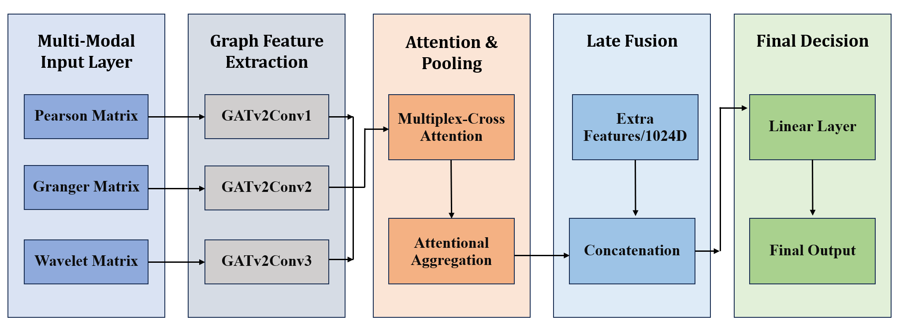
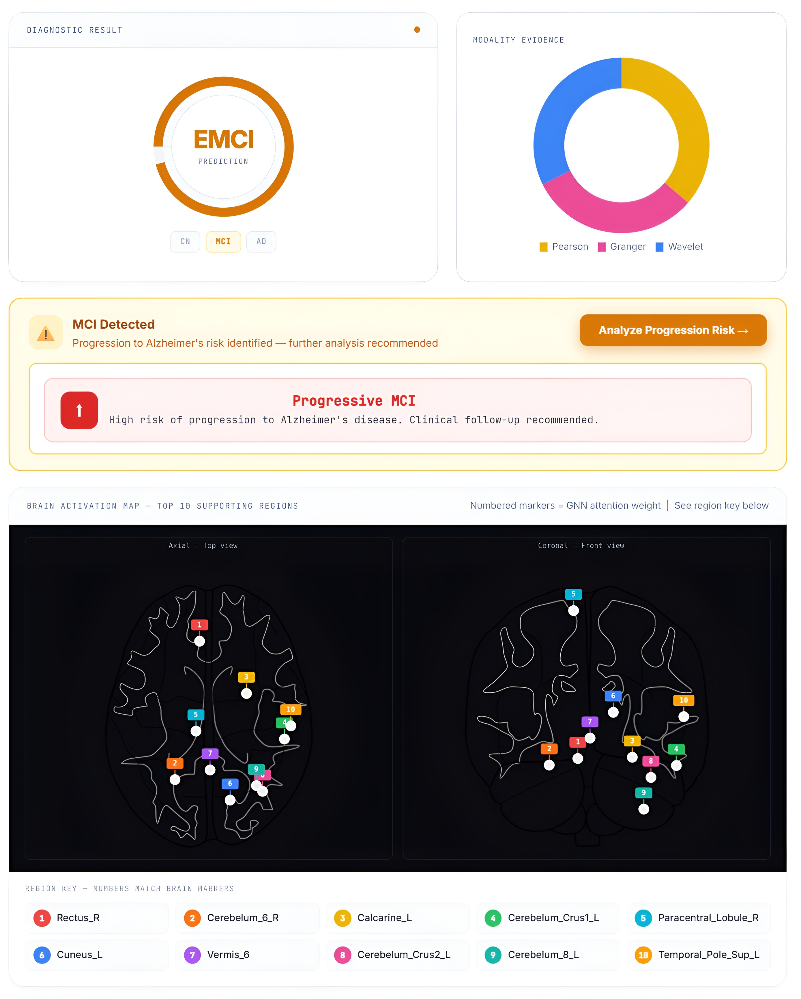

# NeuroVista: Multi-Modal GNN for Early Alzheimer’s Detection

**NeuroVista** is a cutting-edge deep learning framework designed for the early prognosis of Alzheimer’s Disease (AD). By leveraging **Graph Neural Networks (GNNs)** and **resting-state fMRI (rs-fMRI)** data, the system identifies subtle disruptions in brain network topology to differentiate between cognitive stages and predict the conversion from Mild Cognitive Impairment (MCI) to AD.

---

## Research Goal & Objectives
**Goal:** To identify individuals at high risk of converting from Mild Cognitive Impairment (MCI) to Alzheimer's Disease using advanced neuroimaging-based computational techniques.

* **Innovate:** Develop a GNN-based technique to classify **progressive MCI (pMCI)** and **stable MCI (sMCI)**.
* **Analyze:** Enhance predictive performance via **multi-topological connectivity analysis** (Spatial, Spectral, and Directional).
* **Deploy:** Create a **user-friendly web platform** for clinicians to upload fMRI scans and obtain instant diagnostic insights.

---

## Key Features

* **Multi-Topological Mapping**: Goes beyond static connectivity by integrating three distinct brain network views:
    * **Pearson Correlation**: Captures static functional synchronization.
    * **Spectral Coherence**: Captures frequency-domain rhythmic interactions (0.01–0.1 Hz).
    * **Granger Causality**: Captures directional, effective connectivity via Vector Autoregressive (VAR) modeling.
* **Advanced GNN Architecture**: Uses **GATv2** layers to dynamically weigh the importance of neural connections and **Multiplex Cross-Attention (MCA)** to fuse information across modalities.
* **Explainable AI (XAI)**: Integrated attentional pooling and NIfTI-based heatmapping to pinpoint specific brain regions (AAL-116) driving the diagnosis.
* **Clinical Relevance**: Specifically tuned to distinguish between **Stable MCI (sMCI)** and **Progressive MCI (pMCI)** for timely clinical intervention.

---

## System Architecture: End-to-End Pipeline

The framework operates through a standardized neuroimaging pipeline, moving from raw data to clinical insights.

### 1. Data Collection & Preparation
Data is sourced from the **ADNI (Alzheimer’s Disease Neuroimaging Initiative)** repository. 
* **Selection Criteria**: Subjects must have both T1-weighted structural MRI (for anatomical mapping) and rs-fMRI (for functional activity).
* **Format Conversion**: Raw DICOM (.dcm) files are converted to NIfTI (.nii) using **dcm2nii** and organized according to the **BIDS** (Brain Imaging Data Structure) standard.

### 2. Preprocessing Pipeline
Executed using **MATLAB**, **SPM12**, and the **CONN Toolbox**, the data undergoes a rigorous cleaning process:
* **Structural**: Skull stripping, segmentation, and normalization to MNI space.
* **Functional**: Slice-timing correction, motion realignment, coregistration with T1 images, and spatial smoothing.
* **Denoising**: Removal of physiological noise and motion artifacts to extract clean BOLD signals.

### 3. ROI Extraction & Graph Construction
The brain is parcellated into 116 regions using the **AAL Atlas**.
* **Signal Extraction**: Mean BOLD time-series are extracted for each region.
* **Graph Modeling**: These signals are transformed into three parallel adjacency matrices (Pearson, Granger, Wavelet), representing the brain as a sequence of weighted graphs.

### 4. Model Inference: NeuroVistaGNN
The core model processes these graphs through:

* **Spatial Feature Learning**: Independent GATv2 heads for each connectivity modality.
* **Feature Fusion**: The MCA module identifies consensus patterns across temporal, spectral, and directional data.
* **Early Detection**: Classification into CN, EMCI, LMCI, or AD, with a focus on predicting MCI-to-AD conversion.

---

## Visual Insights

### Interface & Analytics

*Figure 1: **The NeuroVista Research Suite Dashboard.** This interface allows clinicians to upload preprocessed fMRI data. It provides a real-time diagnostic classification and an "Explainability" panel that highlights the top 10 brain regions contributing to the result.*

### 🧠 Connectivity Mapping

*Figure 2: **Multi-topological Functional Connectivity.** This visualization compares Pearson correlation, frequency-based Wavelet coherence, and directional Granger causality to capture a holistic "fingerprint" of neural dysfunction.*

---

## 💻 Tech Stack

* **Backend**: Python (Flask)
* **Deep Learning**: PyTorch, PyTorch Geometric (PyG)
* **Neuroimaging**: Nilearn, Scipy (Signal processing)
* **Data Analysis**: Statsmodels (VAR models), Joblib
* **Frontend**: HTML5, Chart.js (Research Suite UI)
* **Preprocessing Tools**: MATLAB, SPM12, CONN Toolbox

---
