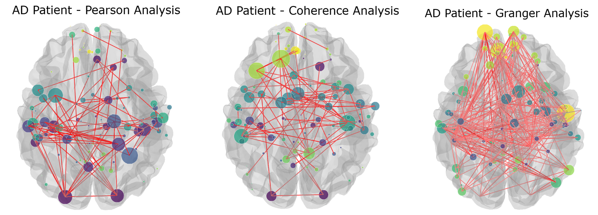

# Neurovista: A Deep Learning Framework for Early Detection of Alzheimer’s Disease using fMRI
---
## Overview

**NeuroVista** is a deep learning system that predicts **whether a person with Mild Cognitive Impairment (MCI) will develop Alzheimer’s Disease (AD)**.

Instead of detecting Alzheimer’s after it happens, NeuroVista focuses on **early prediction**—during the *pre-dementia stage*, when intervention is still possible.

---

## The Problem

- Alzheimer’s develops slowly over years  
- Many patients are first diagnosed with **MCI**  
- But **not all MCI patients progress to Alzheimer’s**  
- Doctors cannot reliably predict who will progress  

This uncertainty is the biggest challenge.

---

## Our Solution

NeuroVista analyzes **brain activity (rs-fMRI scans)** and learns patterns of how different brain regions communicate.

It helps to:
- Identify **high-risk patients (pMCI)**  
- Identify **stable patients (sMCI)**  
- Predict **future progression to Alzheimer’s**

---

## How It Works (Simple)

1. **Input: Brain Scan (fMRI)**  
   Captures brain activity over time  

2. **Brain as a Network**  
   - Brain regions → Nodes  
   - Connections → Edges  

3. **Deep Learning Model (GNN)**  
   Learns patterns in brain connectivity  

4. **Prediction Output**  
   - CN / MCI / AD classification  
   - Risk of progression  

---

## Key Features

### Multi-View Brain Connectivity
NeuroVista combines three types of brain connections:

- **Pearson Correlation** → Which regions activate together  
- **Spectral Coherence** → Frequency-based activity patterns  
- **Granger Causality** → Direction of information flow

This gives a **complete picture of brain function**

---

### Advanced Model (GNN + Attention)
- Uses **Graph Neural Networks (GNNs)**  
- Uses **GATv2 (Attention)** to focus on important brain regions  
- Uses **Cross-Attention** to combine multiple views  

---

### Explainable AI
- Highlights **top brain regions influencing prediction**  
- Makes results easier for clinicians to understand  

---

## System Architecture

**Pipeline:**
1. Preprocess fMRI data  
2. Extract brain regions (AAL Atlas)  
3. Build connectivity graphs  
4. Apply GNN model  
5. Generate prediction  

---

## Data Processing Pipeline

### 1. Data Collection
- Dataset: **ADNI**
- Input: MRI + rs-fMRI scans  
- Format: DICOM → NIfTI (BIDS standard)

---

### 2. Preprocessing
Using **SPM12 & CONN Toolbox**:
- Motion correction  
- Slice timing correction  
- Normalization (MNI space)  
- Noise removal  

---

### 3. Graph Construction
- Brain divided into **116 regions (AAL Atlas)**  
- Extract BOLD signals  
- Build:
  - Pearson matrix  
  - Spectral matrix  
  - Granger matrix  

---

### 4. Model (NeuroVistaGNN)
- Processes graphs using **GATv2 layers**  
- Combines features using **Cross-Attention**  
- Outputs final prediction  

---

## Results

### Performance
- **Accuracy:** 80.91%  
- **ROC-AUC:** 0.9167  

---

### MCI Progression Prediction

| Class | Precision | Recall | F1-Score |
|------|----------|--------|----------|
| sMCI | 0.79     | 0.84   | 0.81     |
| pMCI | 0.83     | 0.78   | 0.80     |

Strong performance in identifying **high-risk patients early**

---

## Web Interface

The NeuroVista dashboard allows:
- Uploading fMRI scans  
- Instant predictions  
- Viewing important brain regions (Explainability)  

---

## Connectivity Visualization

Shows different brain connectivity views:
- Correlation  
- Frequency patterns  
- Directional influence  

---

## Tech Stack

- **Deep Learning**: PyTorch, PyTorch Geometric  
- **Backend**: Flask  
- **Frontend**: HTML, Chart.js  
- **Neuroimaging**: Nilearn, SciPy, Statsmodels  
- **Preprocessing**: MATLAB, SPM12, CONN Toolbox  

---

## Project Team

- **Darsana R**  
- **Diya Soyi**  
- **Helan Lophy**  
- **Aparna Sabu**  

**Guide:** Prof. Shijin Knox G U  
**Institution:** Government Engineering College Palakkad  

